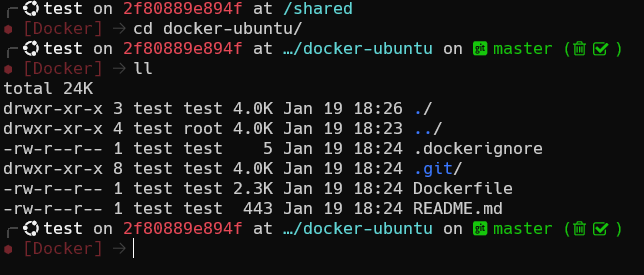
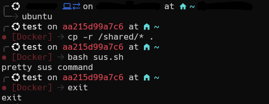

# docker-ubuntu

## what's this?
An Ubuntu:22.04 based docker image you can use as a playground for any command you don't want to run directly on your host machine or to install conflicting packages

Some tools already installed:

- nala
- python 
- pip 
- nodejs 
- npm
- git
- starship bash shell
- a few net tools



It features the admin user `test:test` with access to `sudo` commands without password to use scripts and packages that require a non-root user and at the same time root access in scripts

## How to run

Run the container with:
```
docker run -it --rm massiccio/docker-ubuntu:latest
```
Or with a shared folder in read only:
```
docker run -it --rm -v .:/shared:ro massiccio/docker-ubuntu
```
Make a permanent alias for quick access

```
echo "alias ubuntu='docker run -it --rm -v .:/shared:ro massiccio/docker-ubuntu'">>~/.bashrc && . ~/.bashrc
```
Run it with `ubuntu` and stop with `exit`



Make you own image with what you want with a Dockerfile
```
FROM massiccio/docker-ubuntu:latest

USER test
RUN sudo nala update
RUN sudo nala install -y foo
RUN pip install bar
```
